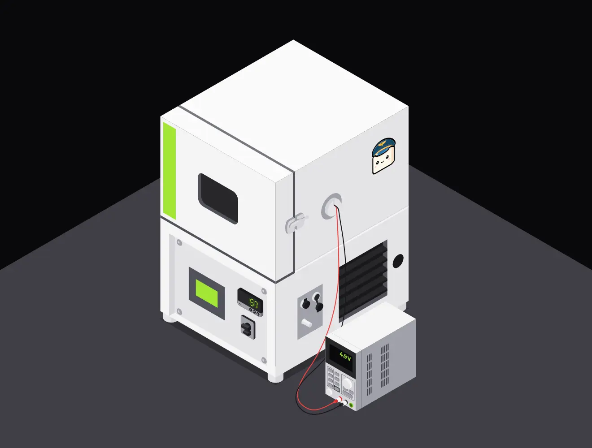

# Framework IMU Thermal Calibration



A TofuPilot Framework procedure that calibrates an IMU (accelerometer + gyroscope) for temperature drift. Runs through a thermal sweep, fits per-axis polynomials, validates noise density / temperature sensitivity / R², and saves the calibration to the DUT.

## What This Shows

| Feature | Where |
|---------|-------|
| Mock instrument plug | `plugs/mock_dut.py` (replays `data/imu_raw_data.csv`) |
| Numeric measurements with validators | `procedure.yaml` -- `acc_*` / `gyro_*` noise density, temp sensitivity, R² |
| Multi-dimensional measurements | `procedure.yaml` -- `acc_calibration_{x,y,z}`, `gyro_calibration_{x,y,z}` |
| Aggregation validators on residuals | `mean`, `std`, `p2p` on the residual y-axis |
| Polynomial calibration | `utils/calibrate_sensor.py` |
| Residual + R² goodness-of-fit | `utils/compute_residuals.py`, `utils/compute_r2.py` |
| Auto-identify unit | `procedure.yaml` -- `unit.auto_identify: true` |
| Saving calibration to DUT | end of `phases/thermal_calibration.py` |

## Get Started

1. Sign up for a free TofuPilot account at [tofupilot.app](https://www.tofupilot.app/auth/signup).
2. Open the **New Procedure** flow in the dashboard and clone this template.
3. Follow the dashboard's instructions to set up a station and run the procedure.

For deeper guides, see the [TofuPilot docs](https://www.tofupilot.com/docs/framework) and the [IMU Thermal Calibration template page](https://www.tofupilot.com/templates/imu-thermal-calibration).

## Structure

```
.
├── procedure.yaml                    # Procedure, plugs, phases, measurements
├── phases/
│   ├── connect_dut.py                # Connect to the DUT
│   └── thermal_calibration.py        # Retrieve data, fit, validate, save
├── plugs/
│   └── mock_dut.py                   # Mock DUT plug (replays canned CSV)
├── utils/
│   ├── calibrate_sensor.py           # Polynomial fit
│   ├── compute_noise_density.py
│   ├── compute_r2.py
│   ├── compute_residuals.py
│   └── compute_temp_sensitivity.py
├── data/
│   └── imu_raw_data.csv              # Sample thermal sweep
├── pyproject.toml                    # uv-managed Python project
└── README.md
```

## Replace the Mock with Real Hardware

`plugs/mock_dut.py` reads a static CSV. To run against a physical board, swap it for a plug that streams IMU samples from your firmware (UART, USB CDC, network). The rest of the pipeline (validators in `procedure.yaml` and the calibration logic in `phases/thermal_calibration.py`) stays the same.
